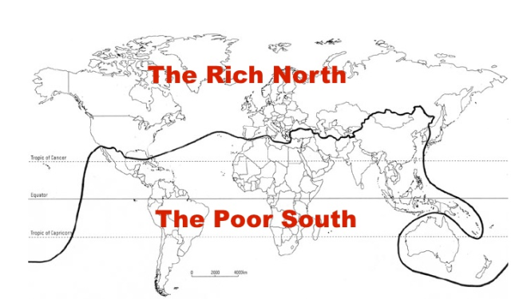
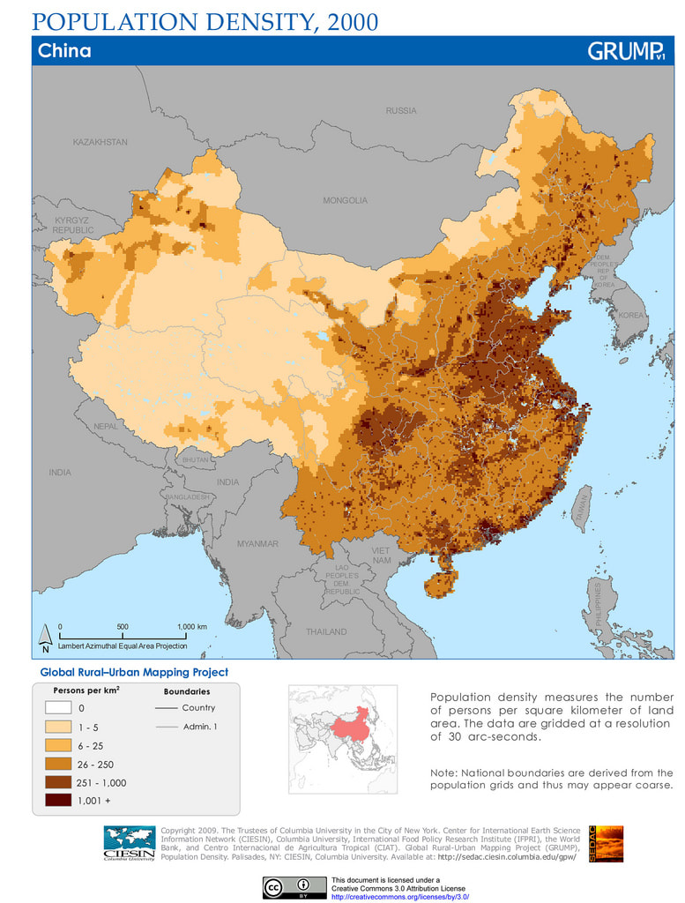
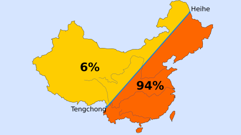
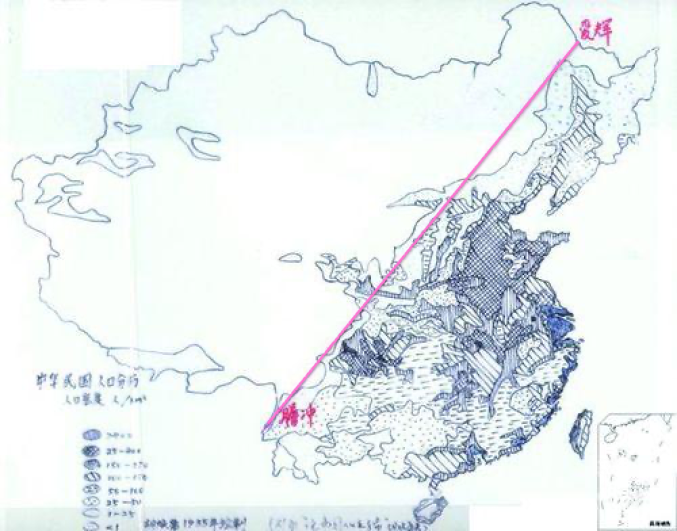
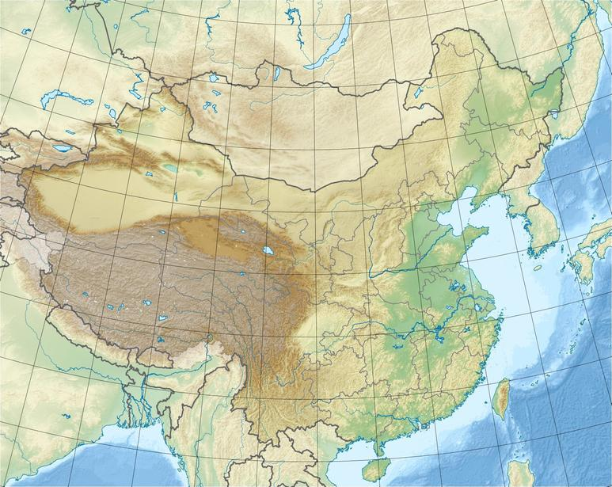
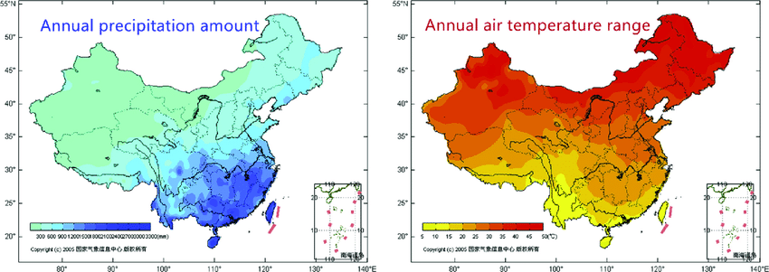
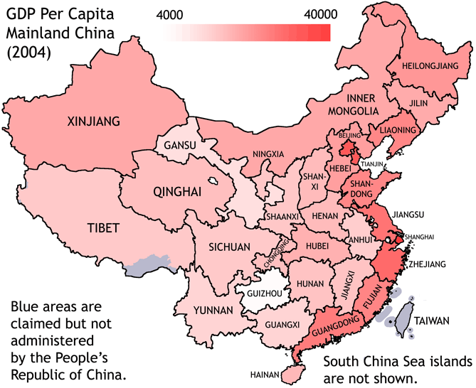

# 1.3 Population distribution and economic development, including voluntary internal migration & core-periphery patterns

##### Core periphery theory: world system concept by Immanuel Wallerstein
- core - areas that attract migration, hold power and much of the wealth
- periphery - places that are not reaping the benefits of globalization

- periphery - rural out-migration, attraction of core regions/mega cities
- Families and communities - 'chain' and 'relay' migration

relative poverty - exists in all societies, regardless of the overall income level of the society
absolute poverty - lack of resources is life-threatening

### Case Study - China's Uneven Population Distribution

- Population - 1.37 billion people (2016)
- growth rate - 0.43% (2017 according to UN)
  - lower than the world average of 1.11%
- One Child Policy removed in 2016
- land area almost 9.6 million km sq
- Population density - 141 people per square kilometer
  - 79th in the world

#### Megacities in China
- Shanghai
- Beijing
- Chongqing
- Guizhou
- Shenzhen
- Chengdu
- Xian
- Wuhan

Population is concentrated in Central East of China near the Coast
  - West of Korean Peninsula

#### Hu Huanyong line
def. Separates China in two parts - line drawn by hand by Mr. Hu
  - west of line has 64% of land but only 4% population
  - 96% of Chinese live on the east on 36 % of land

Original hand drawn document (below)

#### Physical Factors

More plains and grass land near the coat of China including Fujian, Zhejiang, and Henan.

- Tibet and Xinjiang have very low precipitation compared to the South of China with high precipitation
- North China with low precipitation has the highest annual air temperature range

#### Human Factors
- China was an imperial country until 1911
  - very rural
- Final emperor overthrown in 1911
  - republican government established
  - CCP (Chinese communist party) established in 1921
- China's economy subjected to series of 'Five Year Plans' & political/economic campaigns
- Great leap forward between 1958-1960
  - 45 million deaths
- Most economic growth focused on East
  - Estimated 700 million people out of poverty
- improved:
  - education
  - health care
  - electricity
  - running water
- Gap made between rich and poor parts of China
  - led to massive, often state sponsored migration to regional cities and from poorer to richer provinces

People moved out to Eastern China to find better jobs and quality of life to shift the population distribution

|   | China | Niger|
|---|-----|----|
|Key Facts Location Place Names| Eastern China has majority of population citeis (Shanghai, Beijing, Shenzhen), Hu Line, 1.4 Billion people| Niamey (capital),Tahoua, Maradi, Zinder, Dosso (All cities central south), 24 million people, 80% land Sahara desert, 7 kids per woman, LIC, average life expectancy 55 (men)|
|Push and Pull, Employment| More job opportunities in Eastern cities such as Beijing, More hospitable than deserts located in West China | Higher precipitation in South, Southern cities are more industrialized with agriculture, cement, etc, has better transportation|
| Differences, Push and Pull Factors | Chinese industrialization policy (including Five Year Plans) | Less job opportunities
| Degree of challenge for citizens in rural areas | Less precipitation, higher temperatures | North is mostly desert and steppe (poor quality soil with severe/extreme weather)|
