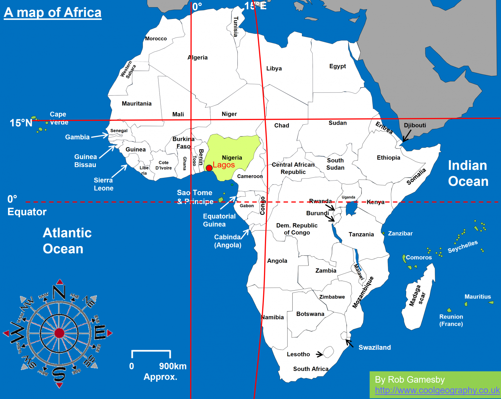
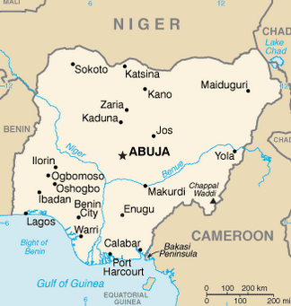
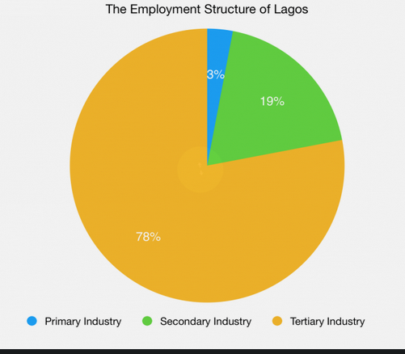

### Case study lagos

- Nigeria's largest city
  - economic capital
  - south west of Nigeria
  - major slave trade center by the 1790s
  - alongside Atlantic ocean, close to border with Benin

- Originally tiny fishing village on an islands
  - of the Yoruba people (called Lagos Oko)
  - Portuguese settlers
  - Capital in the early twentieth century
  - city expanded north into the mainland by 1960
  - population boom occured during 1970 due to oil industry growth
    - continued during 80s and 90s
  - population increase by 600,000 a year
  - 9 million people living in the city proper
    - 17.5 million or so in the urban area.
  - dominated by system of islands, sandbars, and lagoons
    - city sprawls over what used to be four main islands (now attached together by land reclamation)

- Original settlement on northwestern tip is now a slum
  - narrow streets
  - poor housing
  - overcrowding
- Business District in Lagos Island's southwest
  - multi story buildings
  - center of
    - commerce
    - finance
    - administration
    - education
    - electronics equipment production
    - automobile assembly
    - food and beverage processing
    - metal works
    - paint and soap production
    - textile
    - cosmetics
    - pharmaceutical manufacturing
    - fishing industry

- center of trade and commerce
  - 80% of Niegria's industry located within Lagos
  - generates 25% of Nigeria's GDP
  - has an international airport and import seaport

#### Consequences of growth

| Factor | Positive | Negative |
|---|----|---|
| Social | More people in the city, growth | Health care access 0.4 docters per 1000, frequent power cuts, 80% relies on diesel generators|
| Environmental | | Modifying of island structures and land reclamation |
| Political | Second largest city in Africa with power, contributes to growth of the national economy | Slums and poor housing|
| Economic | 25% of Nigeria's GDP | Low income, 9.9% unemployment, informal employment|

