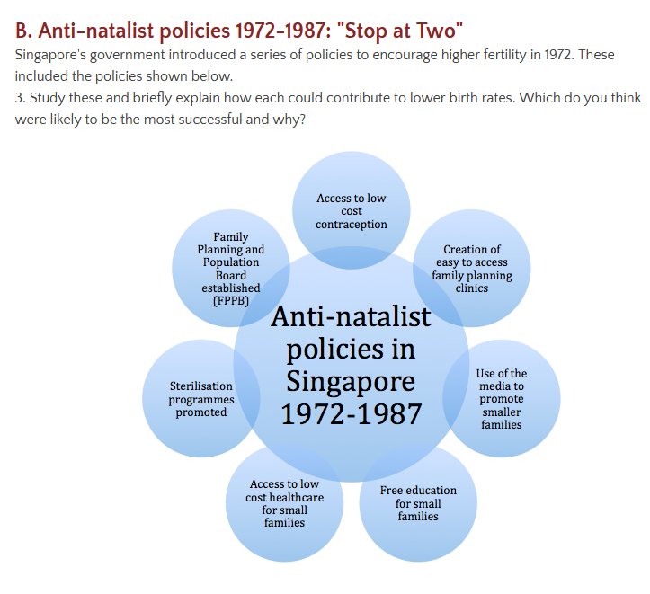
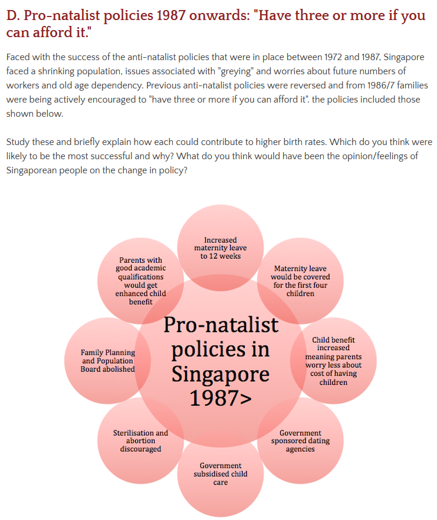

### Global trend in HICs / MICs
- Most countries have seen a decline in the fertility rate over the past 30 years (below population replacement rate of two children per women)
- Average household size has decline
  - sharp increase in the proportion of women entering the labor force
  - Both men and women want to first establish themselves in the labor market before starting family
- Birth rates have fallen
- life expectancy has increased

#### General cause of gender in-balance
- deliberate gendercide
- infanticides
- ageing
- war casualties
- sex - selective abortions

### Aging population:
- Problems:
  - Rising healthcare costs
  - higher dependency ratios
  - shifting economies and cities
  - rising tax to support older generation
  - state pension
- Benefits:
  - some businesses make more profits as elderly people spend more money on holidays and leisure
  - more childcare support from grandparents for people with families
- Causes:
  - Japan is HIC country which has good healthcare  
  - childcare is expensive

### Pro - natalist policies in Singapore from 1987
- child benefit increases
- maternity leave
- family planning and population board abolished
- government sponsored dating agencies
- government subsidized child care
- Sterilizations and abortion discouraged
- increased maternity leave for 12 weeks
- parents with good academic qualifications would get enhanced child benefit

### China natal policies
- anti natal Policy
  - reasons for policy
    - combat population explosion
      - imbalances between population and available resources
      - China has 7% of world's agricultural land
      - 23% of population
    - encourage economic development
      - improving the standard of living for the population
  - mechanisms
    - law to limit number of birth applied to Han majority
    - cash bonus, improved housing and free medical care for limited child households
    - free birth control and family planning
    - age limits and certificates required for marriage
    - financial penalties for more than one child (3x salary)

### Demographic dividend:
def
- demographic dividend - economic growth potential that can result from shifts in a population’s age structure, mainly when the share of the working-age population is larger than the non-working-age share of the population

#### Ethiopia
- not successful demographic dividend
  - education system not good
    - primary school is not in English and sometimes in local languages
  - low employment rate among youth
  - skilled workers leave the workers

#### South Korea
- successful
  - egalitarian education system
  - decreased fertility rates
  - policies and program

#### Barriers to demographic dividend:
- not having decreased fertility rates
- need to implement policies
- benefits of the demographic dividend are not automatic
- reduced fertility
- rate of fertility decline
