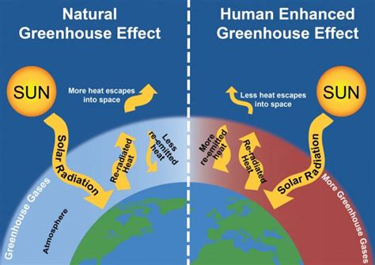
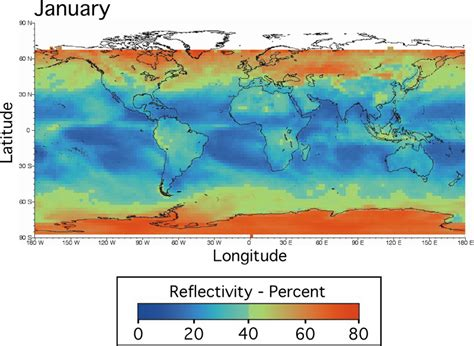

### Natural / Human changes occur to affect the global energy balance
- inputs
  - elements that go into a system
- outputs
  - whatever comes out of the system

The atmosphere is an open system, receiving radiation from both the sun and the earth. the energy of the earth is very small but it does have an effect in particular in urban climates. Incoming solar radiation is referred to as insolation.
The main energy that drives all of our weather systems and our climate comes from the sun. the vast majority of this energy is absorbed at the equator where as energy is generally lost in the polar regions. However, this energy is redistributed to higher latitudes by wind and air circulations.

- radiation - emission of short wave and long waves
  - sun is very hot body, most of its radiation is in the form of very short wavelengths such as ultraviolet and visible light
- convection - transfer of heat by the movement of gas or liquid
- conduction - transfer of heat by contact
- short wave - incoming solar radiation
  - insolation
  - amount of insolation received varies with angle of the sun and cloud type
  - main energy input varies according to altitude
  - visible in wavelengths not absorbed by earth's atmosphere
    - heats the earths from long wave radiation
- long wave - energy from earth into the atmosphere
  - cloudless night means large loss of long wave radiation from earth
  - lack of clouds - little return of long wave radiation from the atmosphere
    - net loss of energy from the surface
  - cloudy night - cloud returns long wave radiation to the surface reducing overall loss of energy
- albedo - fraction of sun's radiation from a surface
  - term has its origin from Latin word albus meaning 'white'

- Negative feedback - when a system acts by lessening the effect of the original change and ultimately reserving it
  - increase in one phenomenon
    - dampening of another phenomenon
  - ex.
    - increased evapotranspiration
    - higher precipitation
    - increased snowfall on polar ice caps
    - reduce mean global temperature
- Positive feedback - occurs within a system where a change causes a snowball effect, continuing or even accelerating the original change
  - increasing one phenomenon
  - ex. global warming
    - melting of polar ice
    - less ice and snow
    - lowers albedo
    - rocks or darker surfaces appear
    - less white surfaces that reflect heatx

- methane
  - chemical compound CH4
  - group 14 hydride
  - simplest alkane
  - mane constituent of natural gas
  - natural methane found below ground and sea

Biosphere - describes one of the four layers that surround the Earth along with:
  - lithosphere (rock)
  - Hydrosphere (water)
  - atmosphere (air)

  major
  - atmosphere
  - Hydrosphere
  - pedosphere
  - Biosphere
  - lithosphere
  - fossil fuels

carbon cycle describes where carbon is stored

- carbon added to atmosphere
  - volcanic eruptions
  - decomposition of plant material
  - removed from the atmosphere through plant growth and other means

carbon measured in unit peta-gram (Pg)

| Event | Geolocation | Environmental impacts | economic cost of damage | social |
| -- | -- | -- | -- | -- |
| Drought| California | Less water and fertility in soil | Less agricultural production , higher cost of water| water shortages and limits on the usage of water|
| Wild fire | Australia | Trees burning, loss of biodiversity | Cost approaching 100 Billion  | People had to move out of house / evacuation |
| Coastal flooding | New Orleans | washed away ecology | costing around 20 billion dollars | Residents need to move out and access insurance, loss of property |

| diseases | Example | people | Places | link to climate change |
| ---- | ------ | ------| ---- | ----- |
mosquito borne |
water borne |
other tropical |
