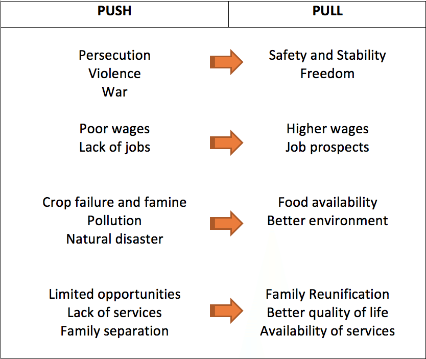

#### migration

Global scale - migration between countries
national scale - migration inside nations

push factor - factors which cause people to leave because of pressures which make them dissatisfied with their present homes
  - Ethnic/religious persecution
  - war
  - forced labor
  - redevelopment

pull factor - perceived qualities that attract people to a new settlement
- better employment
- education
- better social amenities and services
- more security and better life chances

