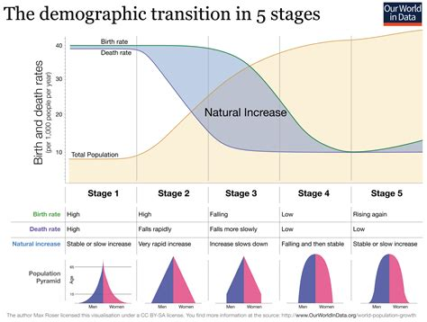

### Demographic Transition Model

- Stage 1
  - Birth rate and death rate are both high
  - Population growth is slow and fluctuating
  - High Birth rate
    - lack of family planning
    - high infant mortality rate: putting babies in the 'bank'
    - Need for workers in agriculture
    - Religious beliefs
    - Children as economic assets
  - Dearth Rate is high:
    - High levels of disease
    - Famine
    - Lack of clean water
    - Lack of health care
    - War
    - Competition for food from predators (like rats)
    - lack of education
  - Typical Britain in the 18th century

  - Stage 2
    - Birth rate remains high
    - death rate falling
      - improved
        - healthcare
        - hygiene
        - sanitation
        - food production
        - transport for food
        - Infant Mortality Rate (decrease)
    - population begins to rise steadily
  - Stage 3
    - Birth rate starts to fall
      - family planning
      - low infant mortality
      - increased mechanization
      - increased standard of living
      - changing status of woman
    - Death Rate Continues to fall
    - Population rising
  - Stage 4
    - Birth rate and death rate both low
    - Population steady
      - increased education for woman
      - fertility rate decline
      - better medical technology
      - increasing life expectancy
  - Stage 5
    - Total population is high
      - starting to decline
    - birth rate falling
      - population no longer replacing itself
      - population is aging, will be dominated by elderly people
      - women are in workforce

| Stage | Type of Pyramid | Age Structure|
| ---- | ---- | ---- |
| 1 | Isosceles | Small population with a youthful profile due to low life expectancy |
| 2 | Isosceles with wider base and higher peak | Large numbers of young|
| 3 | Mid way between isosceles and stable pyramid, may exhibit straight flanks in younger cohorts | Large numbers of economically active and young, increasing number of elderly |
| 4 | Stable pyramid with straight sides | Zero population growth, optimum distribution|
| 5 | Constricted base with straight sides | aging population |

Dependent Ratio:
- def - ratio of those typically not in the labor force and those typically in the labor force
  - Simplistic calculation which is used across the world to understand societies and get a sense of potential pressures the economy may face in supporting an economically dependent population

- young dependent
  - population (0-15 yrs)
- Economically active
  - population (16-65yrs)
- Elderly dependent
  - population (above 65 yrs

Formula for dependency ratio:
(Number of children + Number of Pensioners) / (number of working age)

Child Dependency Ratio
- def. - ratio relates the number of children (0-14) to the working-age population (15-64 years old)
- Youth dependency ratio = (youth 0-14 )/(older population 15-64)

Old-age dependency ratio
- population 64 or above / population (15-64)
