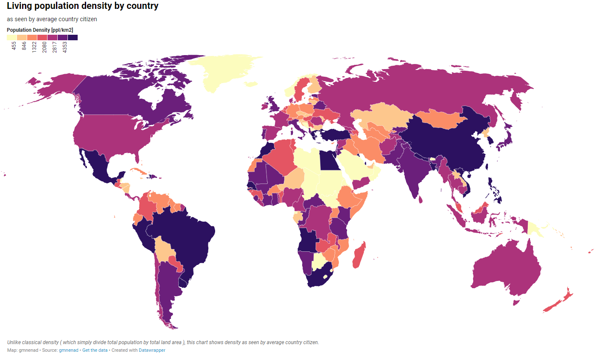

# 1.1 How does population vary between places?
## Population Density
def:
* population distribution - spread of people across the world
population density - number of people living in a particular area, usually in 1 square kilometer

### Physical Factors
1. Relief and landforms
  * High population Density
    * lowland plains
    * flat river valleys
    * deltas
    * volcanic areas with fertile soil
  * Lower population density
    * Mountainous regions with low
2. Climates
3. Soil type and quality
4. Water supply
5. Vegetation
6. Raw materials, natural resources
7. Natural threats

### Human Factors
1. Agriculture
2. Secondary industry
3. Accessibility
4. Political decisions - government policy
5. Conflict - wars and conflicts

def.
* Crude birth rate - number of lives per 1,000 population in a given year (is not growth rate)
* Fertility rate - number of live births per 1,000 women aged 15-49 in a given year
* Total Fertility Rate - Average number of children that would be born to a woman by the time she ended childbearing if she were to pass through all her childbearing years conforming to the age-specific fertility rates of a given year
* Crude death rate - number of deaths per 1000 in a given year
* Infant mortality rate - number of infants who die in their first year per 1000 live births in a given time period (IMR = number of deaths below age 1 year / number of live births in the same year x 1000)
* Life expectancy - Average number of years a person can expect to live at the point of birth, assuming that existing conditions continue
  * Life expectancy is higher for women because:
    * difference in physiological make up
    * substance abuse rates - alcohol, nicotine
    * higher probability of unnatural deaths - violence

Factors affecting fertility rates
* Social/cultural Factors
  * expectations of families and women, education levels, religion
* political Factors
  * government policies (pro and anti natal policies)
* Economic Factors
  * Children viewed as assets in LIC, support from companies for working mothers in HICS
* Demographic factors
  * infant mortality rates
