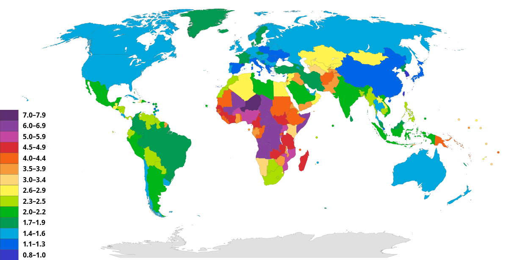

# 1.1 How does population vary between places?
## Population Density
def:
* population distribution - spread of people across the world
population density - number of people living in a particular area, usually in 1 square kilometer

### Physical Factors
1. Relief and landforms
  * High population Density
    * lowland plains
    * flat river valleys
    * deltas
    * volcanic areas with fertile soil
  * Lower population density
    * Mountainous regions with low
2. Climates
3. Soil type and quality
4. Water supply
5. Vegetation
6. Raw materials, natural resources
7. Natural threats

### Human Factors
1. Agriculture
2. Secondary industry
3. Accessibility
4. Political decisions - government policy
5. Conflict - wars and conflicts

def.
* Crude birth rate - number of lives per 1,000 population in a given year (is not growth rate)
* Fertility rate - number of live births per 1,000 women aged 15-49 in a given year
* Total Fertility Rate - Average number of children that would be born to a woman by the time she ended childbearing if she were to pass through all her childbearing years conforming to the age-specific fertility rates of a given year
* Crude death rate - number of deaths per 1000 in a given year
* Infant mortality rate - number of infants who die in their first year per 1000 live births in a given time period (IMR = number of deaths below age 1 year / number of live births in the same year x 1000)
* Life expectancy - Average number of years a person can expect to live at the point of birth, assuming that existing conditions continue
  * Life expectancy is higher for women because:
    * difference in physiological make up
    * substance abuse rates - alcohol, nicotine
    * higher probability of unnatural deaths - violence

#### Fertility rates arround the world

Factors affecting fertility rates
* Social/cultural Factors
  * expectations of families and women, education levels, religion
* political Factors
  * government policies (pro and anti natal policies)
* Economic Factors
  * Children viewed as assets in LIC, support from companies for working mothers in HICS
* Demographic factors
  * infant mortality rates

#### Mortality Rates

Factors that affect mortality rates:
* Social/Cultural factors
  * education level of women
  * medical technology
    * availability of antibodies
    * AIDs drugs
    * immunization
* Political - government policies
  * Public health campaigns
* Economic Factors
  * Food and Nutrition
  * manufactured goods
* Demographic factors
  * age
  * diseases

#### migration

Global scale - migration between countries
national scale - migration inside nations

push factor - factors which cause people to leave because of pressures which make them dissatisfied with their present homes
  - Ethnic/religious persecution
  - war
  - forced labor
  - redevelopment

pull factor - perceived qualities that attract people to a new settlement
- better employment
- education
- better social amenities and services
- more security and better life chances

# 1.3 Population distribution and economic development, including voluntary internal migration & core-periphery patterns

##### Core periphery theory: world system concept by Immanuel Wallerstein
- core - areas that attract migration, hold power and much of the wealth
- periphery - places that are not reaping the benefits of globalization

- periphery - rural out-migration, attraction of core regions/mega cities
- Families and communities - 'chain' and 'relay' migration

relative poverty - exists in all societies, regardless of the overall income level of the society
absolute poverty - lack of resources is life-threatening

### Case Study - China's Uneven Population Distribution

- Population - 1.37 billion people (2016)
- growth rate - 0.43% (2017 according to UN)
  - lower than the world average of 1.11%
- One Child Policy removed in 2016
- land area almost 9.6 million km sq
- Population density - 141 people per square kilometer
  - 79th in the world

#### Megacities in China
- Shanghai
- Beijing
- Chongqing
- Guizhou
- Shenzhen
- Chengdu
- Xian
- Wuhan

Population is concentrated in Central East of China near the Coast
  - West of Korean Peninsula

#### Hu Huanyong line
def. Separates China in two parts - line drawn by hand by Mr. Hu
  - west of line has 64% of land but only 4% population
  - 96% of Chinese live on the east on 36 % of land

Original hand drawn document (below)

#### Physical Factors

More plains and grass land near the coat of China including Fujian, Zhejiang, and Henan.

- Tibet and Xinjiang have very low precipitation compared to the South of China with high precipitation
- North China with low precipitation has the highest annual air temperature range

#### Human Factors
- China was an imperial country until 1911
  - very rural
- Final emperor overthrown in 1911
  - republican government established
  - CCP (Chinese communist party) established in 1921
- China's economy subjected to series of 'Five Year Plans' & political/economic campaigns
- Great leap forward between 1958-1960
  - 45 million deaths
- Most economic growth focused on East
  - Estimated 700 million people out of poverty
- improved:
  - education
  - health care
  - electricity
  - running water
- Gap made between rich and poor parts of China
  - led to massive, often state sponsored migration to regional cities and from poorer to richer provinces

People moved out to Eastern China to find better jobs and quality of life to shift the population distribution 
