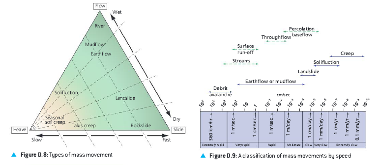

mass movement:
- def
- classified by types according to cause (physical and human), liquidity, speed of onset, duration, extent and frequency

physical factors:
- earthquakes
- gravity
- prolonged and heavy rainfall - link to climate change
- types of soil
- gradient of slopes
- water content
- vegetation

two types:
- fast movements
  - avalanches
- dry movements
  - rockfalls
- fluid movements
  - mudflows

soil creep, slumping, debris flow, rockfall

types:
rock fall or topple
falling, bouncing, and rolling of debris down slope
land slides and rock slides
debris flows - type of landslide made up of a mixture of water-saturated rock debris and soil with a consistency similar to we cement. Debris flow move rapidly downslope under the influence of gravity. Sometimes referred to as earth flows or mud flows
avalanche -

slope failure caused by two factors:
- internal resistance reduction or shear strength of the slope
- increase in shear stress - the forces attempting to pull a mass downslope

risk from natural hazards cannot be eliminated but can be understood to minimize the hazard to humans

reduce vulnerability
- demographic factors
  - size of vunerable population
  - population density
- socio economic factors
  - country's level of development
  - individual's wealth
- community preparedness
  - public education
  - recent hazard events
  - early warning systems
  - building codes
- community's ability to deal with a hazard event
  - government
  - effective lines of communication
  - emergency personnel
  - insurance cover
  
