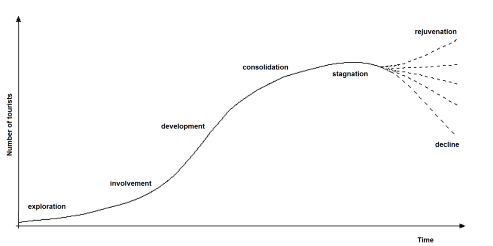

## 3rd part of unit

1. niche tourism
2. role of tncs
3. tncs and the cost and benefits for different stakeholders
4. tourism as a national development strategy 
5. international sporting events 
6. south african football world cup 2010

Niche Tourism - special interest tourism catering for realtively small numbers of tourists. There are many types of niche tourism, including adventure, movie location and heritage tourism

Examples: 
- Movie location tourism
- disaster tourism - 
- adventure tourism - involves travel to a remote area and some level of risk, increased in popularity attracts high value customers

social benefit: 
- improvemnet of infrastructure which would benefit local people
- encourages the celebration of customs and cultural events

economic benefits 
- provides valable foreign exchange
- extra tax revenue for government
- provides direct employment
- tourism can produce a 'multiplier effect'

Environmental benefits
- tourism has conserved natural and cultural resources that would have become derelict otherwise 

social costs: 
- cultural conflicts and abandonment of traditional customs and moral values
- increase in local crime 

economic costs
- inflates local prices of goods and services
- jobs in tourism are mainly seasonal
- tourism is volatile and subject to downturns
- 'leakage' can easily occur

environmental costs:
- visitors are causing footpath erosion
- heavy rainfall, steep slopes, deforestaiton and trampling of vegetation can lead to landslides
- local infrastructure cannot cope with recent urbanization. Urubamba river is overloaded with untreated sewage and its banks are convered with garbage

Examine reasons why the growth of tourism hotspots can become unsustainable? (10 marker) 

- why there is growth in tourism, processes affecting inbound, definition of tourism hotspots.
- what are the consequences, how does it affect stakeholders
- how is that unsustainable

def: 
- vertical integration - takes places when a tnc controls two or more stages of supply chain
- horizontal integration - tnc controls more than one compnay at the same stage of the supply chain

What is TNC?
- trans national coorporations

name three TNCs:
- Expedia, Priceline, Thomas Cook

TNC can offcer cheap tourism opportunities because they can take economies of scale to their advantge. They can lower per unit costs. 

Economies of scale means that as companies become larger, they can save money. 

Horizontal integration is owning separate companies in same stage of supply chain, vertical integration is owning different processes inside of the supply chain 

national developmental strategy - govenrment policy that encourages tourism and that brings benefits to the country. Most countries have national development strategies relating to aspectrs of their economics or social development

butler model of tourism

past question: 10 marker - Evaluate the costs and benefits of tourism as a national development strategy? 

### Pros and cons of Morocoo's nationalized tourist strategy: 
#### Pros: 
- Support from govenrment
- national commitment to sustainabilty
- stimulus to ensure resilience through stimulus checks
- foreign invvestments
- TNC investment and interaction with Morocco
- growth in inbound tourists 

#### Negative; 
- Tourist negligence of environment
- Exploitation of local culture

### Earthquake's effect on Morocco's tourism: 
- tourists, locals, and workers injured during earthquake
- infrastructure and structures meant for tourists damaged

10 maker preparation: 
- some LICs use industrialization as a pathway to economic development
- others turn to tourism as a national development strategy 
- it is seen as a way to bring substantial income, similar to manufacturing, albeit without the environmental pollution 
- it is more reliable source of income with rather stable prices
- constantly renewable supply of tourists available from richer countries Tourism has a high potential profitability 
- often quicker way of raising national income compared to exporting primary products or developing the manufacturing sector 
- countries may require visitors to bring to bring in certain mounts of foreign currency per day of stay that is not allowed to be taken out of the country at the end of the trip, to encourage foreign investment for the local economy

