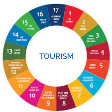

### sports tourism and management

nexus hotspots

def: 
physical carrying capacity - incldues the maximum number of visitor who can be physically present at a certain time and place

real carrying capacity - maximum number of visitors who can be a trecreational place, considering limiting factors resulted from specific conditions of the place and their effect on physical carrying capacity

effective carrying capacity - maximum number of visitors which ca be maanged sustainability by the existing management

def: 
sustainable tourism (from UN) - tourism tha takes full account of its current and future economic, social nad environmental impacts, addressing the needs of visitors, the industry, the environment and host communities

### Sustainable toursim should: 
1. make optimal use of environmental resources that constitute a key element in tourism development, maintaining essential ecological processes and helping to conserve natural heritage and biodiversity 
2. respect the socio-cultural authenticity of host communitites, conserve their built and living cultural heritage and traditional values, and contribute to inter-cultural understanding of tolerance
3. Ensure viable, long-term economic operations, providing socio-economic benefits to all stakeholders that are fairly distributed, including stable employment and income earning oppotunities and social services to host communities, and contributing to poverty alleviation

### Examples of sustianable eco tourism: 

- THe Gambia
	- Ecolodge in the Gambia
	- has solar panels, disattached from the grid
	- solar heated water
	- liveable wage
	- pension, payed leave
	- no comission to artists promoting culture
- costa rica
	- rancho margot (sustainable resort)
	- off the grid resort
	- make their own food 
	- generate own electricity
	- 'zero carbon' due to buying credits for co2
	- family owned
- India, reality tours
	- run by an indian
	- tour a slum in Munbai
	- experience what slum life is like
	- spread the idea that slum life is not all miserable
	- incrase understanding for slum lfie community
	
	- DHRAVI, INDIA
	- contributed to 6,000 children enrolling in education
	- Negative: social tensio
	
Eco-tourism:
- involves travel to natural destinations
- mimises impact
- builds environments
- provides direct financial benefits for conservation
- provides financial benefits and empowerment for local people
- respects local culture
- supports human rights and democratic movements

def- responsible travel to natural areas that conserve the environment, sustians the well-being of the local people, and involves interpretation and education.

- economic
	- advantages
		- major means of foreign earnings
		- balance economic development
		- job opportunities
	- disadvantages
		- leakage of income
		- incarase unhealthy economic gap among locals
- social
	- advantage
		- promotion and conservation of various local culture, arts, traditions
		- education for the importance of culture
		- culture exchange
	- disadvantage
		- various social problems
		- undersireable commercdialization of cultural and religious assets
- environmental
	- advantages
		- incentives for conservation of natural areas
		- education about environmental ethics
	- disadvantages
		- indirect damage of vegetation
		- decay of habitats
		- pollution
		- commercialization of natural resources

international tourism affected by:
- age of social media
	- globalization

Threats summary to internatioanl tourism:
- terror inpmactsed global travel
- travel bans
- drones and disruptive technology
- destinations deemed unsafe
- Covid 19 pandemic

def 

- diaspora - popoulation scattered across regions which are separate from its geographic place of origin
		- word used in reference to people who identify with aspecific geographic location, but currently reside elesewhere
		

catchment area of recreation and sports facilities - catchment area is the area from which a facility attracts a population that uses its services
	- national sport stadium compared to a local park
range of recreation sport facilities
	- range refers t othe maximum distance that people travel to access the facilities
	- people travel a longer distance to go to professional baallet as opposed to amateur ballet

